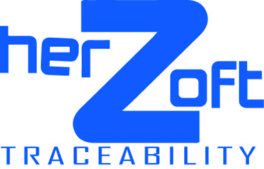

<picture>
    <source srcset="public/images/LOGOHERZ.jpg"  
            media="(prefers-color-scheme: dark)">
    
</picture>

# Local Installation

- run `` git clone ``
- repositori ``https://github.com/isdrael4590/herzoft.git``
- run ``composer install `` 
- run `` npm install ``
- run ``npm run dev``
- copy .env.example to .env
- run `` php artisan key:generate ``
- set up your database in the .env
- run `` php artisan migrate --seed ``
- run `` php artisan storage:link ``
- run `` php artisan serve ``
- then visit `` http://localhost:8000 or http://127.0.0.1:8000 ``.

# Admin Credentials
> Email: ferisdra@hotmail.com || Password: 12345678

## Demo

Features

# License
