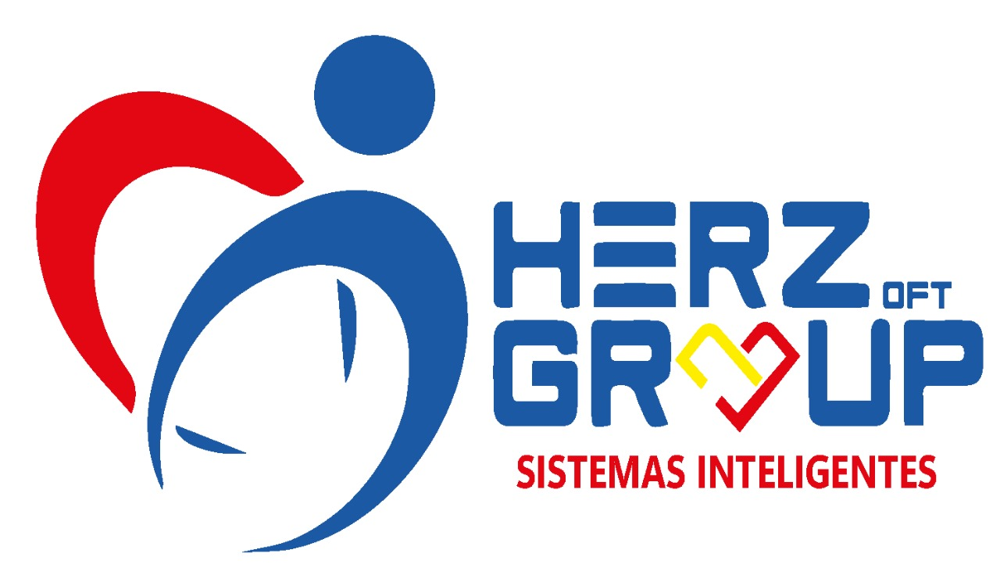

# Herzoft



## Instalación

1. Instale Docker Engine para su plataforma como se explica aquí [Instalación](https://docs.docker.com/engine/install/)
2. Clone los archivos de este repositorio, por ejemplo con `git clone git@github.com:isdrael4590/herzoft.git`
3. Instale las dependencias de software necesarias para correr el proyecto, por ejemplo para Ubuntu:

   ```bash
   sudo apt update && sudo apt install composer php php-curl php-dom php-gd php-zip
   ```

4. Para iniciar con las opciones de desarrollo o correr los contenedores, instale las dependencias de PHP proyecto a través del siguiente comando:

   ```bash
   composer update
   ```

5. Los contenedores utilizan [variables de entorno](https://docs.docker.com/compose/environment-variables/set-environment-variables/) para establecer valores globales de funcionamiento, en la primera configuración, por favor haga una copia del archivo `.env.example` y renombrelo como `.env` y editelo si es necesario, un ejemplo como se hace en Linux sería de la siguiente forma:

   ```bash
   cp .env.example .env
   ```

6. Añade el nombre del servidor sin www en

```sh
DOMAIN=herzgroup.net
```

1. Las contraseñas de MySQL y del Administrador son almacenadas a través de [Docker secrets](`https://docs.docker.com/compose/use-secrets/`) por seguridad. Antes de iniciar el programa, es necesario crear dos archivos en la carpeta `database/credenciales` llamados `root_password.txt` y `user_password.txt` para establecer las constraseñas de MySQL y una en la carpeta `credenciales/admin.txt` para las credenciales de Adminstrador, use cualquier editor de texto para realizar esta tarea o con el siguiente comando en Linux.

   ```bash
   mkdir database/credenciales && mkdir credenciales
   echo ejemplo_contraseña_root_secreto > database/credenciales/root_password.txt
   echo ejemplo_contraseña_user_secreto > database/credenciales/user_password.txt
   echo ejemplo_contraseña_admin > credenciales/admin.txt

   ```

2. El proyecto utiliza la herramienta [sail](https://laravel.com/docs/8.x/sail) de Laravel para gestionar los contenedores, para iniciar el desarollo, inice los contenedores con el siguiente comando:

   ```bash
   sudo chown -R $USER: .
   ./vendor/bin/sail up -d
   ./vendor/bin/sail artisan up
   # En otro terminal
   ./vendor/bin/sail artisan key:generate
   ./vendor/bin/sail artisan migrate --seed
   ./vendor/bin/sail artisan storage:link
   ```

3. Para inicializar las bases de datos por primera vez, se recomienda utilizar el comando `./vendor/bin/sail artisan migrate:fresh --seed`
4. El proyecto correrá y estará disponible en la dirección [http://localhost](http://localhost)

## Despliegue

1. Inicializar contenedores

```bash
./vendor/bin/sail down # Desactiva el modo debug
docker compose -f docker-compose.prod.yml up nginx laravel-horizon -d --build
```

1. Establecer las configuraciones iniciales de Laravel

   ```bash
   docker compose -f docker-compose.prod.yml exec app php artisan key:generate
   docker compose -f docker-compose.prod.yml exec app php artisan migrate --seed
   docker compose -f docker-compose.prod.yml exec app php artisan storage:link
   docker compose -f docker-compose.prod.yml exec app php artisan optimize
   ```

2. Generar el certificado HTTPS de Let's Encrypt con el siguiente comando`docker compose -f docker-compose.prod.yml run --rm certbot`
3. Reiniciar nginx con para recargar las configuraciones.

```bash
docker compose -f docker-compose.prod.yml exec nginx nginx -s reload
```

### Despliegue Local

En caso desees usar el servidor en modo producción en tu computadora, utiliza los siguientes comandos para generar un certificado local compatible con el proyecto.

```bash
source .env
KEYS_PATH=docker/etc/letsencrypt/live/$DOMAIN
mkdir -p $KEYS_PATH
PRIV_KEY="$KEYS_PATH/privkey.pem"
FULL_KEY="$KEYS_PATH/fullchain.pem"
openssl genrsa -out $PRIV_KEY 4096
openssl req -new -x509 -sha256 -key $PRIV_KEY -out $FULL_KEY -days 3650 -subj "/CN=herzgroup.net"
```

> **Important Note:** "herZoft" uses Laravel Snappy Package for PDFs. If you are using Linux then no configuration is needed. But in other Operating Systems please refer to [Laravel Snappy Documentation](https://github.com/barryvdh/laravel-snappy).

## Credenciales

- `admin@admin.com`, contraseña en el archivo `credenciales/admin.txt`

## Licencia

Comercial, Todos los derechos reservados Herzoft© 2024

## Problemas conocidos

- No se cargan los códigos RUMED descritos en la carpeta `init/codigos_rumed.sql`: Por favor borre el volumen `docker compose down && docker volume rm herzoft_sail-mysql`
- En caso de error 500, `docker compose -f docker-compose.prod.yml exec app php artisan cache:clear` o revisar los permisos de la carpeta `storage/logs`
